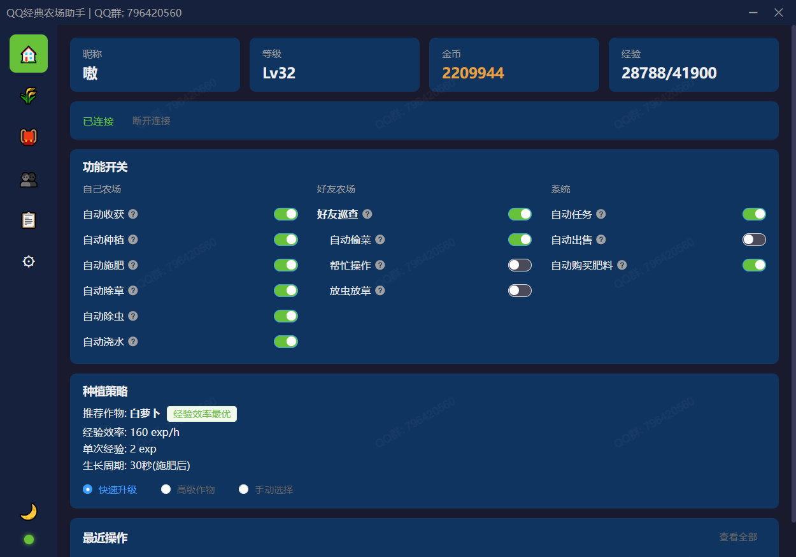
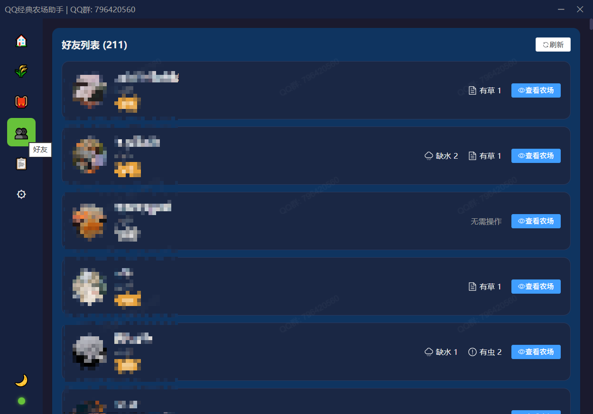
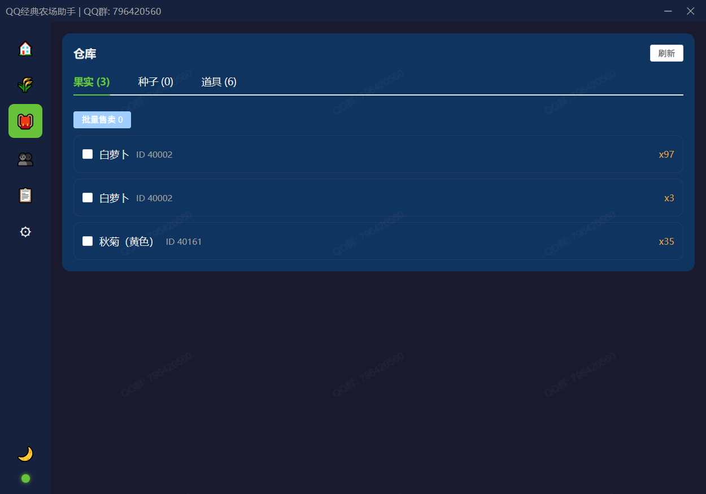
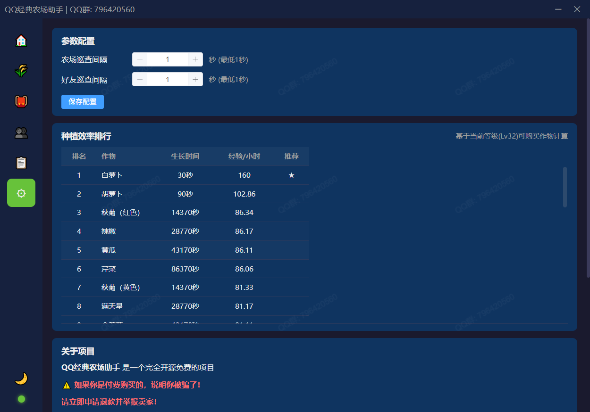
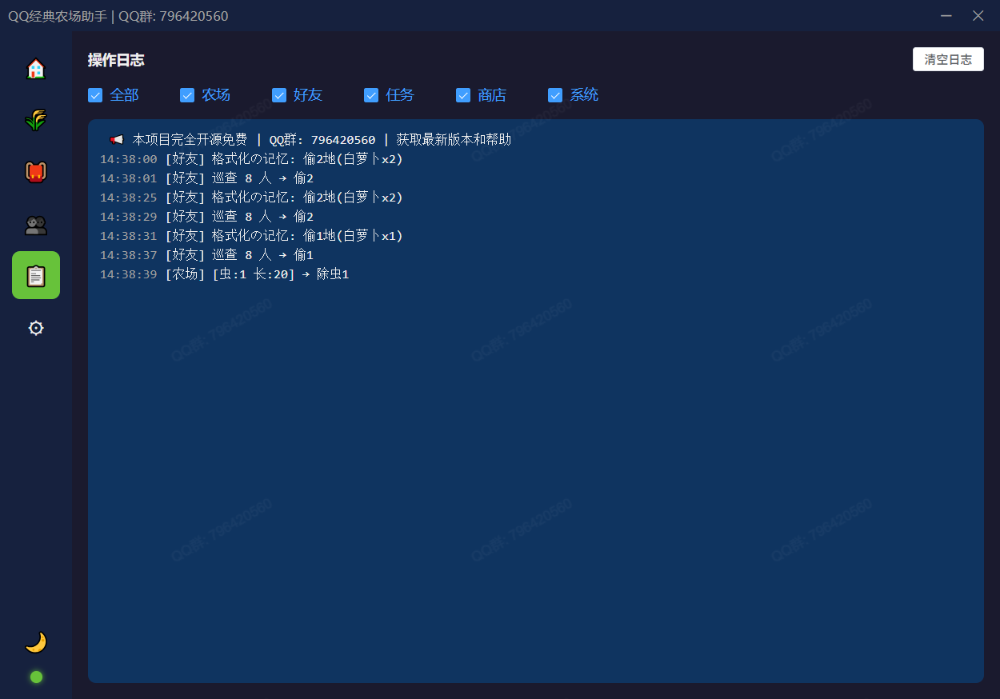

# QQ经典农场助手

## ⚠️ 仓库状态：仅发布，不维护源码

本仓库仅用于分发安装包与发布说明，源码不在此仓库维护。

---

## 📥 下载与更新

1. 打开 [Releases](https://github.com/QianChenJun/qq-farm-bot/releases)
2. 下载最新 `QQFarmBot-*-Portable.exe`
3. 双击运行（免安装）
4. 后续请始终通过 Releases 获取新版本

## 📸 应用截图

<table>
<tr>
<td width="33%" align="center">

 <b>首页</b>
</td>
<td width="33%" align="center">

 <b>土地</b>
</td>
<td width="33%" align="center">

 <b>好友</b>
</td>
</tr>
<tr>
<td width="33%" align="center">

 <b>背包</b>
</td>
<td width="33%" align="center">

 <b>设置</b>
</td>
<td width="33%" align="center">

 <b>日志</b>
</td>
</tr>
</table>

## ✨ 核心能力

- 自动收获、种植、施肥、浇水、除草、除虫
- 好友巡查、偷菜、好友帮助
- 自动任务、自动出售、商城购买（可选）
- QQ/微信双平台支持
- 可视化界面与实时日志

## ❓ 常见问题

### 1) 为什么仓库代码不是最新？

此仓库已调整为仅发布仓库，不再同步源码开发内容。

### 2) 去哪里拿最新版本？

仅通过 [Releases](https://github.com/QianChenJun/qq-farm-bot/releases) 下载。

### 3) 付费买到软件怎么办？

本项目免费开源，请立即退款并通过官方 Releases 获取版本。

---

如果你觉得项目有帮助，欢迎点一个 Star。

